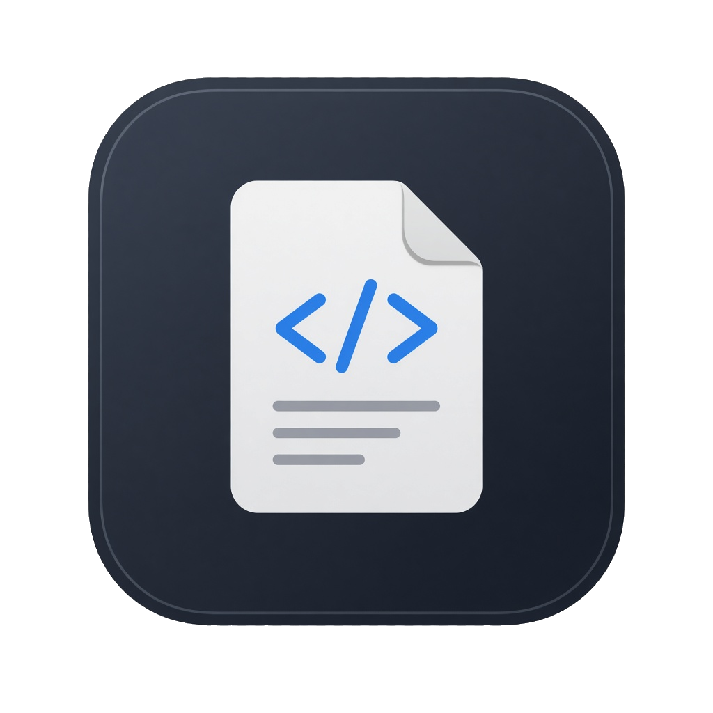

# CodeBrief

Windows-app som tar källkod, identifierar språket och skriver en pedagogisk rapport på svenska.

Klistra in kod eller släpp en fil. CodeBrief gissar språket direkt, kör analys och visar sex sektioner: översikt, pseudokod, flöde, buggar/säkerhet, förbättringar och rättad kod.



## Funktioner

- **Språkdetektion** offline: C#, Python, C/C++, Java, JavaScript/TypeScript, Go, Rust med flera
- **Lokal analys** som alltid fungerar, även utan internet
- **AI-analys** via din egen OpenAI- eller Anthropic-nyckel (lagras krypterad med Windows DPAPI)
- **Syntaxfärgning** i editorn
- **Export** till Markdown och PDF
- **Provperiod** på 20 analyser, därefter RSA-signerad licensnyckel
- **Installer** för en fristående 64-bitars `.exe`

## Krav

- Windows 10/11 x64
- För utveckling: [.NET 8 SDK](https://dotnet.microsoft.com/download/dotnet/8.0)

## Kör från källkod

```powershell
dotnet restore
dotnet test
dotnet run --project src/CodeBrief.Desktop
```

## Användning

1. Klistra in kod eller öppna en fil (`Ctrl+O`).
2. Tryck **Analysera** (`Ctrl+Enter`).
3. Läs rapporten till höger. Exportera med **Markdown** (`Ctrl+S`) eller **PDF** (`Ctrl+Shift+P`).
4. Under **Inställningar** kan du välja OpenAI eller Anthropic och klistra in en API-nyckel. Utan nyckel används den lokala motorn.
5. Under **Licens** aktiverar du en `CB1.`-nyckel när provperioden är slut.

API-nyckeln lämnar aldrig din dator utom till den provider du valt. CodeBrief skickar inte nyckeln till någon egen server.

## Bygg installer

```powershell
powershell -ExecutionPolicy Bypass -File scripts/publish.ps1
```

Resultatet:

- `publish/win-x64/CodeBrief.exe` — self-contained, ingen .NET-installation krävs
- `dist/CodeBrief-Setup-1.0.0.exe` — Inno Setup-installer (om Inno Setup 6 är installerat)


## Projektstruktur

```
src/CodeBrief.Desktop      WPF-klient
src/CodeBrief.Core         språkdetektor, lokal analys, AI-klienter
src/CodeBrief.Contracts    JSON-rapportmodell
src/CodeBrief.Licensing    RSA-licens
tools/CodeBrief.LicenseGen skapa nycklar
tests/CodeBrief.Tests      enhetstester
installer/                 Inno Setup
```

## Kortkommandon

| Shortcut | Åtgärd |
|---|---|
| `Ctrl+Enter` | Analysera |
| `Ctrl+O` | Öppna fil |
| `Ctrl+N` | Rensa |
| `Ctrl+S` | Exportera Markdown |
| `Ctrl+Shift+P` | Exportera PDF |
| `Ctrl+,` | Inställningar |

## Licens för källkoden

MIT. QuestPDF används under Community License.
